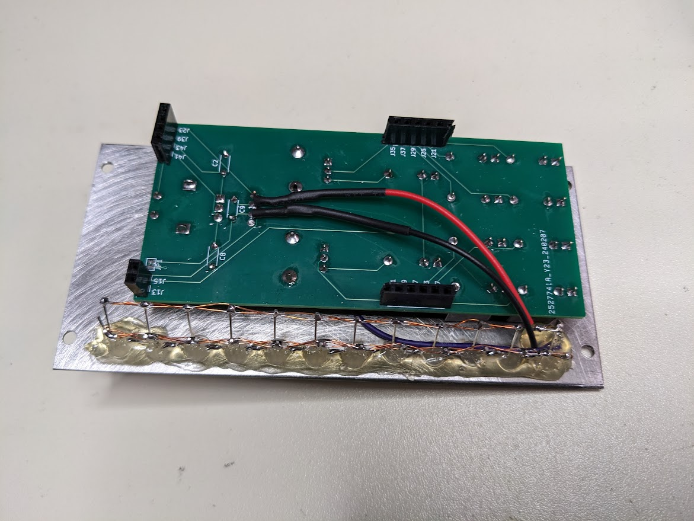

# Dual Quantizer

## Specs
 * Range 0 to 5V
 * Arduino Nano based
 * Encoder knob for selecting scale
 * Encoder button for selecting which quantizer is displayed on the LEDs
 * Transpose with CV control
 * Portamento with CV control
 * LED for displaying
    * Red for left quantizer, Green for right quantizer
    * Trigger in
    * Current scale
    * Current CV note out
 * Two quantizers
    * CV input
    * CV output
    * Trigger in - CV input is sampled on rising edge and output until next trigger.
    * Trigger out - A pulse out each time the CV output changes
 * Scales
    * Major
    * Minor natural
    * Minor harmonic
    * Pentatonic major
    * Pentatonic minor
    * Blues major
    * Blues minor
    * Chromatic

## Calibration
Use a multimeter to calibrate the voltage reference to 5.0V. This voltage reference is used by the Arduino and the MCP4921s. The easiest place to measure this is at the AREF socket. This can be done when doing other voltage tests when first applying power to the board.
1. Apply power to the board
1. Connect a multimeter to monitor AREF
1. Adjust the trim pot until the voltage reads 5.0V.

## BOM
| Part | Quantity | Link |
|-----|-----|-----|
| Arduino Nano | 1 | [Tayda](https://www.taydaelectronics.com/nano-3-0-controller-compatible-with-arduino-nano-usb-driver.html) |
| MCP4921 DIP-8 | 2 | [Mouser](https://www.mouser.com/ProductDetail/Microchip-Technology/MCP4921-E-P?qs=1zyQUV6YKYz%252BhdPnOOm6sg%3D%3D), [Digikey](https://www.digikey.com/en/products/detail/microchip-technology/MCP4921-E-P/716280) |
| TL072 DIP-8 | 1 | [Tayda](https://www.taydaelectronics.com/tl072-low-noise-j-fet-dual-op-amp-ic.html) |
| TL431 TO-92 | 1 | [Tayda](https://www.taydaelectronics.com/tl431acl-tl431-precision-shunt-regulator.html) |
| 2N3904 TO-92 | 4 | [Tayda](https://www.taydaelectronics.com/2n3904-npn-general-propose-transistor.html) |
| 5mm WS2811 F5 LED | 13 | [AliExpress](https://www.aliexpress.us/item/2251832527100547.html?gatewayAdapt=glo2usa4itemAdapt), [ebay](https://www.ebay.com/itm/225210423475?itmmeta=01HS53S4ZVHJHBY52T8WQZB1ET&hash=item346f9658b3:g:pUQAAOSwwGdf8ocz&itmprp=enc%3AAQAJAAAAwCDUYGcz5qj68xjJYhneY0VaI0AsSksXRR7zNsdxxVYPv%2BTpHbM6i6Cse7igi7r5pkI4ketezPmbqDTaU3huAlq58YY7W5qptqD56XkPZG7GSnOwLtegVyQoB51Hfvr%2BzgxCyjLdDuAnd0qzc8QuIPkxoM4O4NsTp0nrkO%2FBAysmSOFaF0JAeZIQaoKVNi9e1xnuLqgQoH9CKrZYwR4DYm8v4WXOQEnFtDER7cRtcld9aYo08zqe6yW89MqrQOQFFA%3D%3D%7Ctkp%3ABk9SR4jQ5KPJYw)|
| 1x2 vertical pin header | 1 | [Tayda](https://www.taydaelectronics.com/40-pin-male-2-54-mm-single-row-pin-header-break-away-round-pin-gold-plated.html) |
| 1x4 vertical pin header | 1 | [Tayda](https://www.taydaelectronics.com/40-pin-male-2-54-mm-single-row-pin-header-break-away-round-pin-gold-plated.html) |
| 1x5 vertical pin header | 2 | [Tayda](https://www.taydaelectronics.com/40-pin-male-2-54-mm-single-row-pin-header-break-away-round-pin-gold-plated.html) |
| 1x2 vertical pin socket | 1 | [Tayda](https://www.taydaelectronics.com/2-pin-2-54-mm-single-row-female-pin-header.html) |
| 1x4 vertical pin socket | 1 | [Tayda](https://www.taydaelectronics.com/4-pin-2-54-mm-single-row-female-pin-header.html) |
| 1x5 vertical pin socket | 2 | [Tayda](https://www.taydaelectronics.com/5-pin-2-54-mm-single-row-female-pin-header.html) |
| Rotary encoder (footprint is Alps EC12E) | 1 | [Tayda](https://www.taydaelectronics.com/rotary-encoder-11mm-20-detents-d-shaft-with-switch-vertical.html) |
| 9mm vertical potentiometer 50k | 2 | [Tayda](https://www.taydaelectronics.com/50k-ohm-linear-taper-potentiometer-round-shaft-pcb-9mm.html) |
| Potentiometer 3296W 1k | 1 | [Tayda](https://www.taydaelectronics.com/1k-ohm-trimmer-potentiometer-cermet-25-turns-3296w.html) |
| 330 1/4W resisitor | 1 | [Tayda](https://www.taydaelectronics.com/330-ohm-1-4w-1-metal-film-resistor.html) |
| 1k 1/4W resisitor | 2 | [Tayda](https://www.taydaelectronics.com/10-x-resistor-1k-ohm-1-4w-1-metal-film-pkg-of-10.html) |
| 5.1k 1/4W resisitor | 2 | [Tayda](https://www.taydaelectronics.com/resistor-5-1k-ohm-1-4w-1-metal-film-pkg-of-10.html) |
| 10k 1/4W resisitor | 4 | [Tayda](https://www.taydaelectronics.com/10-x-resistor-10k-ohm-1-4w-1-metal-film-pkg-of-10.html) |
| 15k 1/4W resisitor | 2 | [Tayda](https://www.taydaelectronics.com/10-x-resistor-15k-ohm-1-4w-1-metal-film-pkg-of-10.html) |
| 33k 1/4W resisitor | 2 | [Tayda](https://www.taydaelectronics.com/resistor-33k-ohm-1-4w-1-metal-film-pkg-of-10.html) |
| 100k 1/4W resisitor | 6 | [Tayda](https://www.taydaelectronics.com/10-x-resistor-100k-ohm-1-4w-1-metal-film-pkg-of-10.html) |
| 10nF capacitor 5mm spacing | 2 | [Tayda](https://www.taydaelectronics.com/10nf-0-01uf-100v-5-polyester-film-box-type-capacitor.html) |
| 100nF capacitor 5mm spacing | 7 | [Tayda](https://www.taydaelectronics.com/0-1uf-100v-5-polyester-film-box-type-capacitor.html) |
| 10uF capacitor 5mm diameter, 2mm spacing | 2 | [Tayda](https://www.taydaelectronics.com/10uf-50v-105c-jrb-radial-electrolytic-capacitor-5x11mm.html) |
| PJ301M or PJ-3001F (Thonkiconn) | 10 | [Tayda](https://www.taydaelectronics.com/pj-3001f-3-5-mm-mono-phone-jack.html) |
| 2x5 IDC Shrouded header (no reverse power protection on this) | 1 | [Tayda](https://www.taydaelectronics.com/10-pin-box-header-connector-2-54mm.html) |
| Schottky diode DO-35 (signal diodes work too) | 8 | [Tayda](https://www.taydaelectronics.com/1n5819-schottky-barrier-diode-1a-40v.html) |
| Knobs | 3 | [Tayda](https://www.taydaelectronics.com/knob-davies-1900h-clone-cream.html) |

## TODO
 * Editable scale
 * Chord mode

## Arduino Dependencies
 * [Adafruit_NeoPixel](https://github.com/adafruit/Adafruit_NeoPixel)
 * [AUnit](https://github.com/bxparks/AUnit) (for tests)

## Notes about LEDs
The 12 scale LED are not included on the schematic or board. My hope was to use these boards for another project. I directly mounted the LEDs to the panel with hot glue and wired them point to point. Wires are connected to the leads of the first lLED. On the back of the board I left the leads long and connected the power wires as pictured below.

### Reversing LED order
You can reverse the LED order if you want the lowest note at the top of the panel. There's a define commented out at the top of leds.cpp `REVERSE_LED_ORDER`. Just uncomment that line to reverse the order.

LEDs are WS2811 (NeoPixel) style, but in a traditional 5mm form factor.

